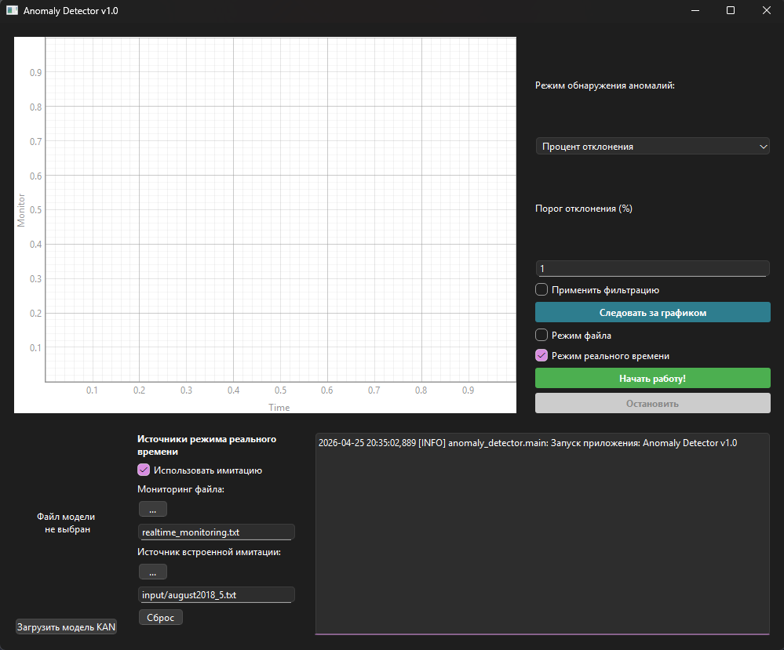
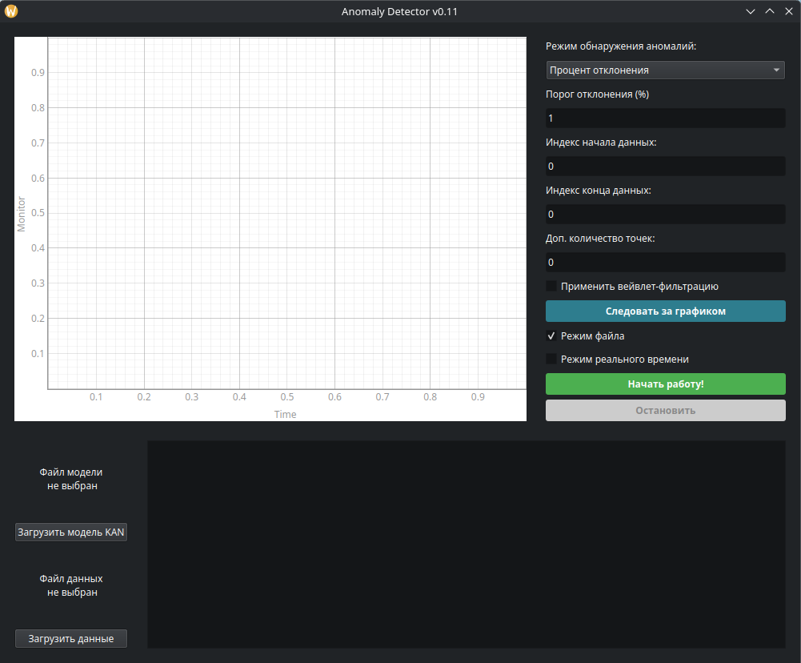

# KANAnomalyDetector

# Сборка

1. Install `python3-venv python3-pip`

Apt distros: 
`sudo apt install python3-venv python3-pip`

2. `python3 -m venv venv` or another python interpreter

3. `source venv/bin/activate` / `.\venv\Scripts\activate`
   
4. `pip install -r requirements.txt`

5. Run script `build_linux.sh` or `build_windows.bat`

Linux `chmod +x build_linux.sh && ./build_linux.sh`

Приложение поддерживает сборку и запуск на двух системах: Linux и Windows. MacOS не поддерживается ввиду невозможности тестирования, однако приложение зависит от библиотек Python, которые кросс-платформенные, поэтому в отдельном порядке пользователь может так же собрать и запустить программу и на MacOS.

В современных дистрибутивах Linux по умолчанию запрещена работа с pip в глобальной, а не виртуальной среде. Перед началом сборки необходимо проверить, что пакеты `python3-venv` и `python3-pip` установлены в системе, затем создать виртуальную среду командой `python3 -m venv venv` (или другим интерпретатором в системе вместо `python3`) и активировать среду с помощью `source venv/bin/activate`. Активация среды в Windows производится командой `.\venv\Scripts\activate`. Затем установить зависимости, использовав команду `pip install -r requirements.txt`, поскольку PyInstaller использует зависимости из окружения и сам устанавливать не умеет.

Для удобства конечного пользователя для Linux сборка производится через bash сценарий `build_linux.sh`, который объявляется исполняемым командой `chmod +x build_linux.sh` и запускается `./build_linux.sh`. Переменные в сценарии содержат ключевые данные для работы: 
*	`APP_ENTRY` – точка входа в приложение, которой является main.py.
*	`APP_NAME` – название приложения, которое будет использоваться для папки и исполняемого файла.
*	`PYTHON_BIN` – вызов исполняемого файла интерпретатора Python3, который проверяет в окружении системы данную переменную или задает по умолчанию `python3`.

Для безопасности и обеспечения работы сценария в строгом режиме задана команда set -euo pipefail. Сборка производится в директории проекта с использованием библиотеки PyInstaller. В сборке, помимо автоматизации и очистки, заданы дополнительные аргументы:
*	`--windowed` – параметр для создания GUI-only приложения без открытия консоли при запуске. 
*	`--collect-all PyQt6` – принудительно собрать все файлы, связанные с пакетом PyQt6 (модули, ресурсы, плагины и т.д.), чтобы гарантировать корректную работу GUI при запуске собранного приложения. 
*	`--onedir` – основной аргумент, который задает сборку приложения в виде директории с зависимостями, то есть портативной директории с необходимыми файлами, библиотеками для работы программы и исполняемым файлом. В отличие от аргумента --onefile, который задает сборку приложения в виде одного полного исполняемого файла, --onedir не имеет ошибки сборки struct.error из-за ограничений формата архива. К тому же собранное приложение занимает примерно 7.5 Гб в готовом к работе виде без учета размера модели, что менее логично для распространения одним большим файлом, чем сжатым архивом с отдельными портативными зависимостями и исполняемым файлом.

Для Windows сборка повторяет работу на Linux, за исключением, что сценарий переписан с bash на batch `build_windows.bat`.

# Запуск

Сборка приложения производится в указанную директорию в сценарии сборки – `APP_NAME`. Запустить приложение можно через исполняемый файл, который называется так же, как и `APP_NAME` директория, нажав два раза по файлу (в зависимости от системы запуск исполняемого файла может отличаться). При запуске через исполняемый файл консоль открываться не будет, соответственно логирования в консоль не будет. Второй вариант запуска приложения – открыть консоль и запустить исполняемый файл стандартным для системы запуском, например, `./APP_NAME`. В данном случае логирование будет вестись в консоль.

1. Install `python3-venv python3-pip`

Apt distros: 
`sudo apt install python3-venv python3-pip`

2. `python3 -m venv venv` or another python interpreter

3. `source venv/bin/activate` / `.\venv\Scripts\activate`

4. `pip install -r requirements.txt`

5. `python3 main.py` or another python interpreter

Запуск приложения возможен из исходного кода без необходимости сборки. Подготовка перед запуском повторяет шаги сборки до запуска сценария сборки:
*	Проверить установлены ли пакеты `python3-venv` и `python3-pip` и установить при их отсутствии.
*	Создать виртуальную среду командой `python3 -m venv venv` (или другим интерпретатором в системе вместо `python3`).
*	Активировать виртуальную среду командой `source venv/bin/activate` на Linux и `.\venv\Scripts\activate` на Windows.
*	Установить необходимые зависимости для работы приложения командой `pip install -r requirements.txt`.
*	Запустить приложение с помощью команды `python3 main.py`, где `python3` может быть заменен на другой вызов интерпретатора Python, если в системе он задан по-другому. Например, на Windows может быть `python`.

Поскольку команды вводятся в консоли, логирование в консоли будет активно. Размер, необходимый для работы приложения, как правило, будет меньше, чем у PyInstaller сборки, так как PyInstaller создает портативное приложение со всеми необходимыми зависимостями отдельно, в том числе интерпретатором, а запуск из исходного кода работает с чистыми исходными файлами, текущей средой с библиотеками и системным интерпретатором Python, если не настроен отдельный.

