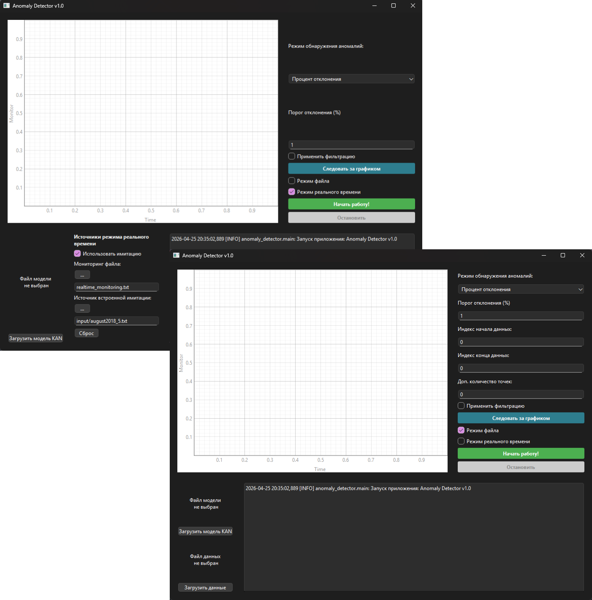
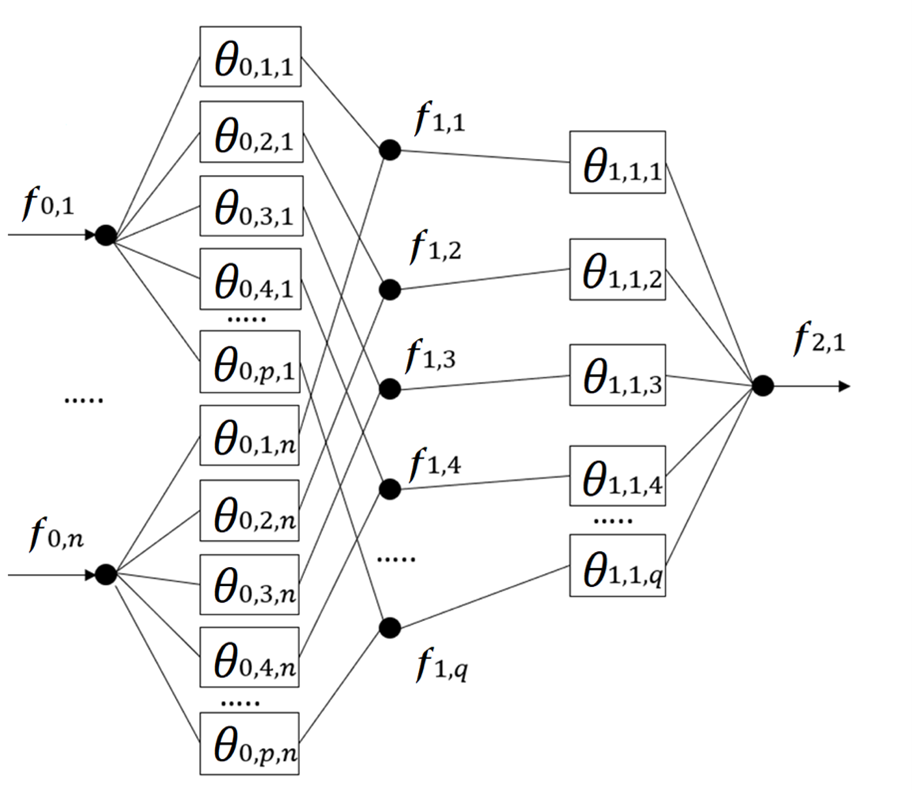

# KANAnomalyDetector

# Сборка

1. Install `python3-venv python3-pip`

Apt distros: 
`sudo apt install python3-venv python3-pip`

2. `python3 -m venv venv` or another python interpreter

3. `source venv/bin/activate` / `.\venv\Scripts\activate`
   
4. `pip install -r requirements.txt`

5. Run script `build_linux.sh` or `build_windows.bat`

Linux `chmod +x build_linux.sh && ./build_linux.sh`

Приложение поддерживает сборку и запуск на двух системах: Linux и Windows. MacOS не поддерживается ввиду невозможности тестирования, однако приложение зависит от библиотек Python, которые кросс-платформенные, поэтому в отдельном порядке пользователь может так же собрать и запустить программу и на MacOS.

В современных дистрибутивах Linux по умолчанию запрещена работа с pip в глобальной, а не виртуальной среде. Перед началом сборки необходимо проверить, что пакеты `python3-venv` и `python3-pip` установлены в системе, затем создать виртуальную среду командой `python3 -m venv venv` (или другим интерпретатором в системе вместо `python3`) и активировать среду с помощью `source venv/bin/activate`. Активация среды в Windows производится командой `.\venv\Scripts\activate`. Затем установить зависимости, использовав команду `pip install -r requirements.txt`, поскольку PyInstaller использует зависимости из окружения и сам устанавливать не умеет.

Для удобства конечного пользователя для Linux сборка производится через bash сценарий `build_linux.sh`, который объявляется исполняемым командой `chmod +x build_linux.sh` и запускается `./build_linux.sh`. Переменные в сценарии содержат ключевые данные для работы: 
*	`APP_ENTRY` – точка входа в приложение, которой является main.py.
*	`APP_NAME` – название приложения, которое будет использоваться для папки и исполняемого файла.
*	`PYTHON_BIN` – вызов исполняемого файла интерпретатора Python3, который проверяет в окружении системы данную переменную или задает по умолчанию `python3`.

Для безопасности и обеспечения работы сценария в строгом режиме задана команда set -euo pipefail. Сборка производится в директории проекта с использованием библиотеки PyInstaller. В сборке, помимо автоматизации и очистки, заданы дополнительные аргументы:
*	`--windowed` – параметр для создания GUI-only приложения без открытия консоли при запуске. 
*	`--collect-all PyQt6` – принудительно собрать все файлы, связанные с пакетом PyQt6 (модули, ресурсы, плагины и т.д.), чтобы гарантировать корректную работу GUI при запуске собранного приложения. 
*	`--onedir` – основной аргумент, который задает сборку приложения в виде директории с зависимостями, то есть портативной директории с необходимыми файлами, библиотеками для работы программы и исполняемым файлом. В отличие от аргумента --onefile, который задает сборку приложения в виде одного полного исполняемого файла, --onedir не имеет ошибки сборки struct.error из-за ограничений формата архива. К тому же собранное приложение занимает примерно 7.5 Гб в готовом к работе виде без учета размера модели, что менее логично для распространения одним большим файлом, чем сжатым архивом с отдельными портативными зависимостями и исполняемым файлом.

Для Windows сборка повторяет работу на Linux, за исключением, что сценарий переписан с bash на batch `build_windows.bat`.

# Запуск

Сборка приложения производится в указанную директорию в сценарии сборки – `APP_NAME`. Запустить приложение можно через исполняемый файл, который называется так же, как и `APP_NAME` директория, нажав два раза по файлу (в зависимости от системы запуск исполняемого файла может отличаться). При запуске через исполняемый файл консоль открываться не будет, соответственно логирования в консоль не будет. Второй вариант запуска приложения – открыть консоль и запустить исполняемый файл стандартным для системы запуском, например, `./APP_NAME`. В данном случае логирование будет вестись в консоль.

1. Install `python3-venv python3-pip`

Apt distros: 
`sudo apt install python3-venv python3-pip`

2. `python3 -m venv venv` or another python interpreter

3. `source venv/bin/activate` / `.\venv\Scripts\activate`

4. `pip install -r requirements.txt`

5. `python3 main.py` or another python interpreter

Запуск приложения возможен из исходного кода без необходимости сборки. Подготовка перед запуском повторяет шаги сборки до запуска сценария сборки:
*	Проверить установлены ли пакеты `python3-venv` и `python3-pip` и установить при их отсутствии.
*	Создать виртуальную среду командой `python3 -m venv venv` (или другим интерпретатором в системе вместо `python3`).
*	Активировать виртуальную среду командой `source venv/bin/activate` на Linux и `.\venv\Scripts\activate` на Windows.
*	Установить необходимые зависимости для работы приложения командой `pip install -r requirements.txt`.
*	Запустить приложение с помощью команды `python3 main.py`, где `python3` может быть заменен на другой вызов интерпретатора Python, если в системе он задан по-другому. Например, на Windows может быть `python`.

Поскольку команды вводятся в консоли, логирование в консоли будет активно. Размер, необходимый для работы приложения, как правило, будет меньше, чем у PyInstaller сборки, так как PyInstaller создает портативное приложение со всеми необходимыми зависимостями отдельно, в том числе интерпретатором, а запуск из исходного кода работает с чистыми исходными файлами, текущей средой с библиотеками и системным интерпретатором Python, если не настроен отдельный.

# Космическая погода и нейтронный монитор
Термин «космическая погода» обозначает динамические и сильно меняющиеся условия в околоземном космическом пространстве, включая состояние Солнца, межпланетной среды, магнитосферы, ионосферы и термосферы, которые могут влиять на работу космических и наземных технологических систем, а также представлять угрозу для здоровья и жизни человека. Космическая погода в первую очередь определяется активностью звезды – Солнца. Ключевыми явлениями, формирующими космическую погоду, являются солнечные вспышки, корональные выбросы массы (КВМ), солнечные энергетические частицы (СЭЧ) и потоки быстрого солнечного ветра. [1]  

Космическая погода вызывает изменения потоков космических лучей в околоземном пространстве. Эти изменения могут быть зарегистрированы наземными детекторами вторичного космического излучения.  

Нейтронный монитор – это наземный детектор космических лучей, предназначенный для непрерывной регистрации вторичной нейтронной компоненты, образующейся при взаимодействии первичных космических частиц, преимущественно протонов и альфа-частиц, с ядрами атомов земной атмосферы. Нейтронные мониторы являются ключевым инструментом в исследованиях космических лучей, физики Солнца, гелиосферы и космической погоды. В 1964 году К. Хэттон и Х. Кармайкл из Чок-Риверской ядерной лаборатории, находящейся в Канаде, представили конструкцию NM-64, которая и по сей день является мировым стандартом нейтронных мониторов. [2] В Полярном геофизическом институте РАН в Апатитах (Мурманск) установлен нейтронный монитор типа 18-NM-64. Это одна из крупных российских станций международной сети мониторинга космических лучей. Станция работает с 1968 года. [3] 

В качестве анализируемых данных использованы данные с наземных станций нейтронных мониторов. Основной геофизической характеристикой, определяющей пригодность станции для регистрации космических лучей, является вертикальная геомагнитная жесткость отсечки. Эта величина характеризует минимальную жесткость, которой должна обладать заряженная частица, чтобы достичь данной точки атмосферы Земли, преодолев геомагнитное поле. [4] Станция OULU, находящаяся в университете Оулу, расположена на северо-западном побережье Финляндии. Как и в Апатитах, на станции OULU нейтронный монитор типа 9-NM-64 работает уже долгое время, с 1964 года. [5] Для обеих станций выполняется ключевое условие: они расположены в полярной зоне, где жесткость отсечки минимальна. Это также положительно сказывается на чувствительности к событиям наземного возрастания или форбуш-понижений. Обе станции сотрудничают с европейской базой данных нейтронных мониторов реального времени – NMDB. Данные нейтронных мониторов передаются даже с частотой в 1 минуту. [6] Высокая стабильность и качество данных, геомагнитные условия, мировой стандарт нейтронного монитора, долгая история, принадлежность к университетам и международное сотрудничество указывают на надежность выбора станций OULU и APTY. 

[1] Schwenn R. Space Weather: The Solar Perspective // Living Reviews in Solar Physics. 2006. Т. 3 URL: https://doi.org/10.12942/lrsp-2006-2  
[2] Hatton C. J., Carmichael H. EXPERIMENTAL INVESTIGATION OF THE NM-64 NEUTRON MONITOR // Canadian Journal of Physics. 1964. Т. 42, № 12. С. 2443–2472 URL: https://doi.org/10.1139/p64-222  
[3] Полярный геофизический институт, Сектор космических лучей [Электронный ресурс]. URL: https://pgia.ru/lang/ru/about/labs/cr  
[4] Dorman L. I., Villoresi G., Iucci N., Parisi M., Tyasto M. I., Danilova O. A., Ptitsyna N. G. Cosmic ray survey to Antarctica and coupling functions for neutron component near solar minimum (1996–1997): 3. Geomagnetic effects and coupling functions // Journal of Geophysical Research: Space Physics. 2000. Т. 105. № A9. С. 21047–21056  
[5]  I.G. Usoskin, E. Valtonen, R. Vainio, P.J. Tanskanen, A.M. Aurela History of cosmic ray research in Finland // Advances in Space Research. 2009. Т. 44. № 10. С. 1232–1236  
[6] NMDB stations [Электронный ресурс]. URL: https://nmdb.eu/station

# Аномалии в космической погоде
Нейтронный монитор регистрирует изменения интенсивности вторичных нейтронов. Основными аномалиями космической погоды, обнаруживаемыми в его данных, являются события GLE (Ground Level Enhancement), или наземное возрастание, и Forbush decrease, или Форбуш-понижения.  

GLE – это резкое увеличение скорости счета наземного детектора космических лучей, вызванное солнечными частицами достаточно высоких энергий болee 500 МэВ, которые распространяются вместе с межпланетным магнитным полем и достигают поверхности Земли. Во время GLE можно определить спектры протонов высоких энергий на границе магнитосферы, используя данные наземного нейтронного мониторинга. [1]  
На временном ряду GLE проявляется как быстрый всплеск сигнала продолжительностью от нескольких минут до нескольких часов.  

Форбуш-понижения – это кратковременные спады интенсивности галактических космических лучей после прохождения коронального выброса массы или межпланетной ударной волны. [2]  
На временном ряду форбуш-понижение выглядит как резкий спад сигнала с последующим постепенным восстановлением в течение нескольких дней.  

Таким образом, нейтронный монитор является важным инструментом диагностики космической погоды. Регистрируемые им данные напрямую отражают экстремальные солнечные процессы, позволяя предпринять меры по противодействию.

[1] H. Mavromichalaki, C. Plainaki, M. Gerontidou, C. Sarlanis, G. Souvatzoglou, G. Mariatos, A. Belov, E. Eroshenko, E. Klepach, and V. Yanke GLEs as a Warning Tool for Radiation Effects on Electronics and Systems: A New Alert System Based on Real-Time Neutron Monitors // IEEE Transactions on Nuclear Science. 2007. Т. 54, № 4. С. 1082–1088 URL: https://doi.org/10.1109/tns.2007.897400  
[2] K. P. Arunbabu, H. M. Antia, S. R. Dugad, S. K. Gupta, Y. Hayashi, S. Kawakami, P. K. Mohanty, A. Oshima, and P. Subramanian How are Forbush decreases related to interplanetary magnetic field enhancements? // Astronomy & Astrophysics. 2015. Т. 580. С. A41 URL: https://doi.org/10.1051/0004-6361/201425115

---

Современные исследования в области факторов космической погоды требуют развития методов их анализа, способных выполнять обработку огромных объемов данных и обеспечивать получение ответа о состоянии околоземного космического пространства с приемлемой точностью в режиме близком к реальному времени. Такие требования обусловлены опасным воздействием космической погоды на человека и его продукты деятельности: радиационное воздействие на людей, нарушение работы и разрушение технологических систем.

# KAN – нейронная сеть Колмогорова-Арнольда
В статье [1] представлен KAN, или Kolmogorov-Arnold Networks – это новый тип архитектур нейронных сетей, предложенный в качестве перспективной альтернативы многослойным перцептронам.
Основное отличие KAN от традиционных нейросетей заключается в следующем:
* KAN обладает обучаемыми функциями на ребрах. В то время как в MLP используются фиксированные функции активации в узлах – «нейронах», в KAN функции активации являются обучаемыми и располагаются на ребрах – «весах».
* В KAN полностью отсутствуют матрицы линейных весов. Каждый весовой параметр заменен на одномерную функцию, параметризованную как сплайн, в частности, B-сплайн.
* Узлы в KAN суммируют входящие сигналы, не применяя к ним никаких нелинейных преобразований.

KAN реализует теорему Колмогорова-Арнольда:
многомерная непрерывная функция с ограниченной вариацией $Y(T)$ может быть представлена в виде конечной суперпозиции непрерывных одномерных функций как в (1):
$$
Y\left(T\right)=Y\left(t_1,\ \ldots,\ t_n\right)=\sum_{q=1}^{2n+1}{\mathrm{\Theta}_q\left(\sum_{p=1}^{n}{\theta_{q,p}(t_p)}\right).\ } \tag{1}
$$

Обучение нейронной сети KAN выполняется на основе алгоритма обратного распространения ошибки. Слой сети KAN с $n_{in}$ входами и $n_{out}$ выходами определяется через матрицу функций, которая имеет вид (2).
$$
\Theta=\theta_{q,p},\: p=1,2,\ldots,n_{in},\ q=1,2,\ldots,n_{out}.  \tag{2}
$$

Типовая архитектура сети KAN является композицией двух слоев KAN, она представлена на рис. 1. Каждая функция активации $\theta_{q,p} (t)$ является, по аналогии с многослойным персептроном, суммой базисной функции (3):
$$
\mathrm{b}\left(\mathrm{t}\right)\mathrm{=t/(1+}\mathrm{\operatorname{e}}^{\mathrm{-t}}) \tag{3}
$$
и сплайн-функции (4):
$$
spline\left(t\right)=\sum_{i}{c_iB_i\left(t\right),} \tag{4}
$$
где $B_i(t)$ – B-сплайны, $c_i$ – обучаемые параметры, $\theta_{q,p}(t)\ =\upsilon_qb(t) +\upsilon_p\ spline(t)$, $\upsilon_b, \upsilon_s$ – обучаемые параметры.

Глубокая сеть KAN является композицией из $L$ слоев KAN в (5):
$$
Y=\left(\Theta_{L-1} \circ \Theta_{L-2} \circ \ldots \circ \Theta_1 \circ \Theta_0\right)T.
$$

Рисунок 1 &ndash; Типовая архитектура нейронной сети KAN

[1] Ziming Liu, Yixuan Wang, Sachin Vaidya, Fabian Ruehle, James Halverson, Marin Soljačić, Thomas Y. Hou, Max Tegmark KAN: Kolmogorov-Arnold Networks // 2 May 2024. URL: https://doi.org/10.48550/arXiv.2404.19756

---

  <a href="docs/Poster_presentation.pdf">
    <kbd style="padding: 9px 17px; font-size: 14px; background-color: #542f69; color: white; border-radius: 7px; border: 1px solid #E5E5E5; display: inline-block;">🪧 Открыть «Новый математический метод обнаружения аномалий в природных временных рядах»  (Poster PDF, 1920x1080)</kbd>
  </a>

---

* Калмак Д.А. «Исследование методов анализа натурных данных и
разработка прототипа программы для обнаружения природных
аномалий» // Научно-технический семинар кафедры МО ЭВМ, 2025
* Калмак Д.А. «Разработка детектора аномалий в натурных данных с
использованием искусственного интеллекта» // Научно-технический
семинар кафедры МО ЭВМ, 2026
* Калмак Д.А., Мандрикова Б.С., Мандрикова О.В. «Новый математический метод обнаружения аномалий в природных временных рядах» // Научно-практическая конференция с международным участием «Наука настоящего и будущего», 2026
